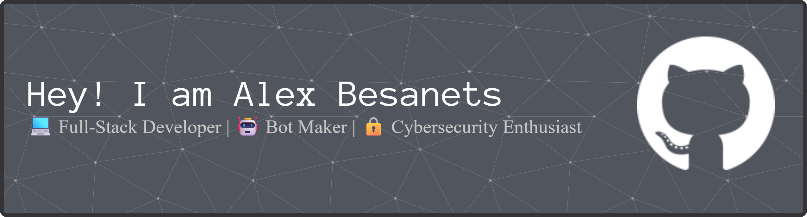

I build stuff for the web, mobile, and automation. Passionate about clean, scalable code and new tech.  
Always pushing further — mastering full-stack dev, experimenting, shipping projects.

---

## 🛠️ Tech Stack  

### 🚀 Languages & Frameworks  

  

### ⚡ Databases & Tools  

  

---

## 📊 GitHub Stats  

  
  

---

## 📫 Connect with me  
  

---

## 🚀 What I Do  
- Build full-stack applications  
- Create automation scripts & bots  
- Work with APIs, servers, and databases  
- Explore cybersecurity & ethical hacking  
- Continually learn & deliver polished projects  

---

## 🎯 Goals  
- Master full-stack dev  
- Launch large-scale impactful projects  
- Develop strong cybersecurity & devops skills  
- Build something that changes lives 🌍  

---

## ⚡ Quote  
> *“The best way to predict the future is to create it.”*  
